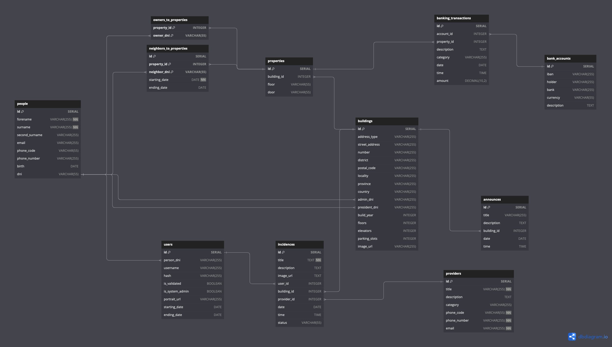

# AppMinistrador DB Seed

Script to build and seed the database of the AppMinistrador app. The database is set with PostgreSQL. **Currently this script only supports building and seeding the database on a local machine**.

The AppMinistrador app is our capstone project for the Full Stack Developer Bootcamp at The Bridge, in Valencia / Spain.  

## Entity Relationship Diagram (ERD)

You can also see the current version of the ERD here: https://dbdiagram.io/d/AppMinistrador-65fdfbadae072629cebf5127

## How to use

You need Make installed and a PostgreSQL database running locally. Use the `.env.example` file as a reference to create an `.env` file with the needed variables. Then open a terminal on this folder and run `make` to execute the script.

## How does it work

- Creates an import schema
- Creates tables for all the existing CSV files with data
- Imports the data into non-normalized tables in the import schema.
- Inserts the data into normalized tables in the public schema.

Please note that the tables on the public schema are not yet normalized.
