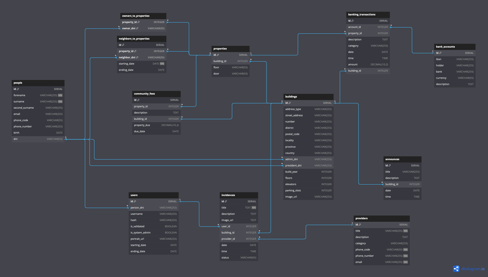

# AppMinistrador DB Seed

Script to build and seed the database of the AppMinistrador app. The database is set with PostgreSQL and hosted on Neon.

The AppMinistrador app is our capstone project for the Full Stack Developer Bootcamp at The Bridge, in Valencia / Spain.  

## How to use

### Requisites:

- Make
- PostgreSQL running locally
- PostgreSQL database hosted on Neon
- `.env` file with the needed variables (use provided `.env.example` as reference)

Once all requisites are met, open a terminal and run `make` in this directory.

## How does it work

1. Creates an import schema on your local PostgreSQL database
2. Creates tables for all the CSV files inside /data
3. Copies the data from the CSV files to the tables on the import schema
4. Creates normalized tables on the public schema
5. Inserts the data into the normalized tables (from the import schema)
6. Creates .sql dump files for all the public tables
7. Uses the dump files to replicate the database to Neon

Please note that the tables on the public schema are not yet truly normalized.

## Entity Relationship Diagram (ERD)

You can also see the current version of the ERD here: https://dbdiagram.io/d/AppMinistrador-65fdfbadae072629cebf5127